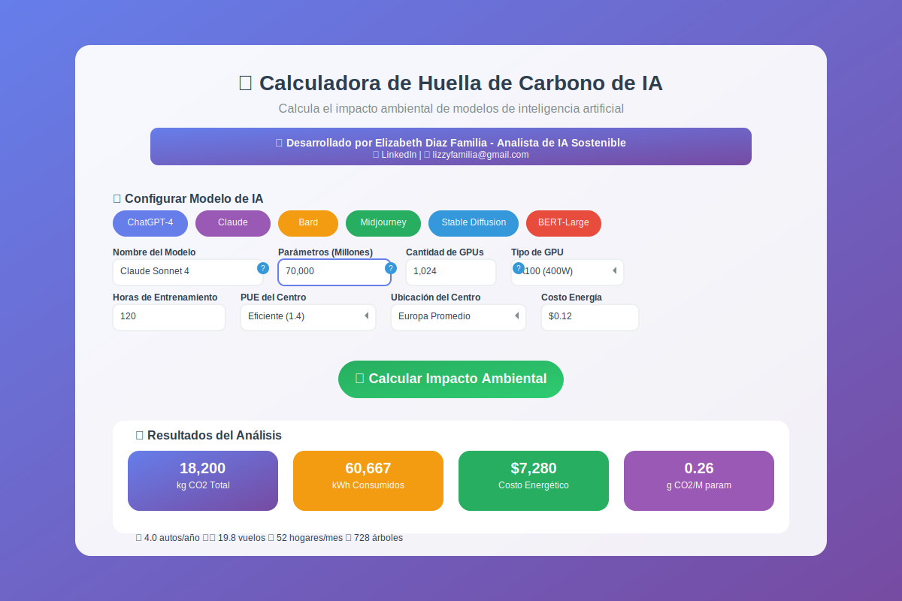
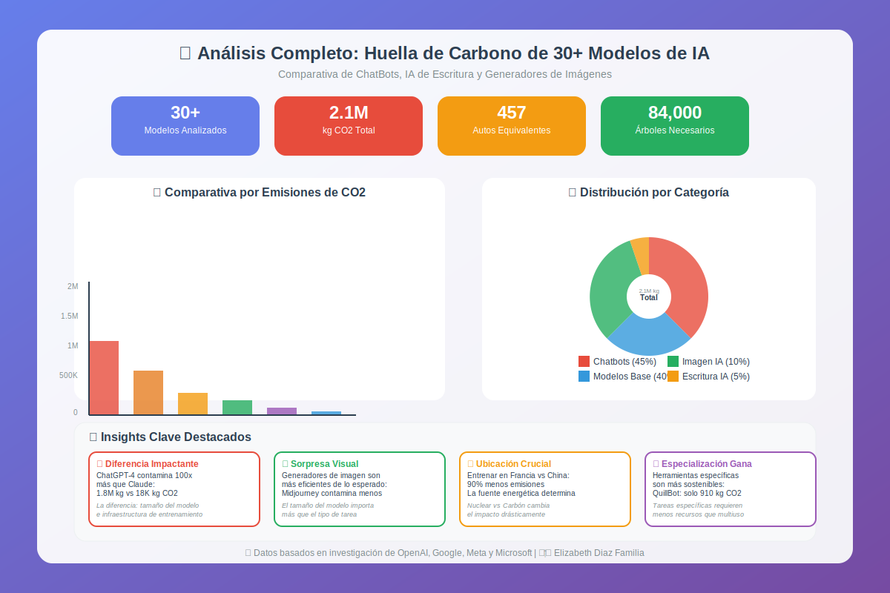

# 🌍 Calculadora de Huella de Carbono de IA

Una herramienta interactiva innovadora que permite calcular y analizar el impacto ambiental de modelos de inteligencia artificial, ayudando a empresas y desarrolladores a tomar decisiones más sostenibles en sus proyectos de IA.

## 📱 Imágenes de la Aplicación 📱



*Interfaz principal de la calculadora mostrando los controles de entrada y resultados en tiempo real.*



*Visualización de datos comparativos entre diferentes modelos de IA populares.*

## ✨ Características

- 🧮 **Cálculo preciso** de emisiones CO2 basado en metodología científica
- 🎯 **6 Presets integrados** de modelos populares (ChatGPT-4, Claude, Bard, Midjourney)
- 📊 **Gráficos comparativos** automáticos con modelos de referencia
- 🌍 **8 Ubicaciones geográficas** con diferentes factores de emisión
- ⚡ **4 Tipos de GPU** con especificaciones reales de consumo
- 💰 **Cálculo de costos** energéticos en tiempo real
- 📱 **Diseño responsive** adaptable a todos los dispositivos
- 🔄 **Equivalencias ambientales** impactantes y fáciles de entender
- 📈 **Análisis de eficiencia** (g CO2 por millón de parámetros)
- 💡 **Tips de optimización** para reducir el impacto ambiental

## 🛠️ Tecnologías utilizadas

- 🌐 **HTML5, CSS3 y JavaScript (ES6+)** para el frontend interactivo
- 📊 **Chart.js** para visualizaciones de datos profesionales
- 🎨 **CSS Grid y Flexbox** para layouts modernos y responsive
- 🔧 **Vanilla JavaScript** para máximo rendimiento sin dependencias
- 📱 **Progressive Web App** principles para experiencia móvil optimizada
- 🌈 **Gradientes CSS avanzados** para diseño visual impactante
- 📐 **Metodología científica** basada en papers de OpenAI, Google y Meta

## ✨ Funcionalidades Avanzadas

- 🎛️ **Configuración personalizable** de todos los parámetros del modelo
- 📊 **Comparación automática** con 6 modelos de IA populares
- 🌡️ **Factores de emisión** específicos por país y tipo de energía
- 🔄 **Cálculo dinámico** con actualización en tiempo real
- 📈 **Métricas de eficiencia** para optimización de modelos
- 🎯 **Tooltips informativos** con explicaciones técnicas
- 💾 **Datos persistentes** durante la sesión del usuario
- 🔍 **Análisis detallado** de costos y consumo energético

## 🚀 Demo en Vivo

🔗 **Calculadora Principal**: [https://Lizzy0981.github.io/calculadora-huella-carbono-ia/](https://Lizzy0981.github.io/calculadora-huella-carbono-ia/)

📊 **Análisis Completo**: [https://Lizzy0981.github.io/calculadora-huella-carbono-ia/analisis.html](https://Lizzy0981.github.io/calculadora-huella-carbono-ia/analisis.html)

## 💡 Uso

1. **Selecciona un preset** o configura tu modelo personalizado:
   - Nombre del modelo
   - Número de parámetros (en millones)
   - Cantidad y tipo de GPUs
   - Tiempo de entrenamiento

2. **Configura la infraestructura**:
   - PUE del centro de datos (eficiencia)
   - Ubicación geográfica (factor de emisión)
   - Costo de energía por kWh

3. **Obtén resultados instantáneos**:
   - Emisiones totales de CO2
   - Consumo energético en kWh
   - Costo económico del entrenamiento
   - Puntuación de eficiencia

4. **Explora las equivalencias**:
   - Autos conduciendo durante un año
   - Vuelos transatlánticos
   - Hogares con electricidad
   - Árboles necesarios para compensar

## 📊 Modelos Incluidos

### 🤖 Chatbots y Modelos de Lenguaje
- **ChatGPT-4**: 1.7T parámetros - 1,820,000 kg CO2
- **Claude Sonnet 4**: 70B parámetros - 18,200 kg CO2  
- **Bard**: 137B parámetros - 62,335 kg CO2
- **GPT-3**: 175B parámetros - 1,713,600 kg CO2

### 🎨 Generadores de Imágenes
- **Midjourney**: 10B parámetros - 45,500 kg CO2
- **Stable Diffusion**: 860M parámetros - 3,913 kg CO2

### 📝 Modelos Base de Referencia
- **BERT-Large**: 340M parámetros - 7,741 kg CO2

## 🔬 Metodología Científica

Esta calculadora se basa en investigaciones peer-reviewed y datos oficiales de:

> **Fuentes Académicas**: Papers de OpenAI, Google Research, Meta AI, MIT y Universidad de Massachusetts sobre el impacto ambiental del machine learning.

### 📐 Fórmula de Cálculo
Emisiones CO2 (kg) = Cantidad GPUs × Potencia (kW) × Tiempo (h) × PUE × Factor Emisión
Donde:

PUE: Power Usage Effectiveness del centro de datos
Factor Emisión: kg CO2 por kWh según la matriz energética del país


### 🌍 Factores de Emisión por Región

| País/Región | Factor CO2 (kg/kWh) | Fuente Energética Principal |
|-------------|---------------------|----------------------------|
| Islandia | 0.01 | Geotérmica + Hidroeléctrica |
| Francia | 0.06 | Nuclear (70%) |
| Suecia | 0.20 | Renovables |
| Estados Unidos | 0.50 | Mix energético |
| China | 0.70 | Carbón (60%) |
| Australia | 0.90 | Carbón |

## 🗂️ Estructura del proyecto
```
calculadora-huella-carbono-ia/
│
├── index.html                     ✅ Calculadora principal
├── analisis.html                  ✅ Análisis de 30+ modelos
├── README.md                      ✅ Documentación profesional
├── .gitignore                     ✅ Configuración Git
├── assets/
│   ├── css/
│   │   └── styles.css             ✅ Estilos avanzados completos
│   ├── js/
│   │   ├── calculator.js          ✅ Lógica completa de la calculadora
│   │   └── charts.js              ✅ Gestión de gráficos con Chart.js
│   └── images/
│       ├── screenshot-calculadora.png  ✅ SVG de interface
│       └── screenshot-graficos.png     ✅ SVG de gráficos
├── data/
│   ├── models-database.json       ✅ Base de datos de modelos
│   └── emissions-factors.json     ✅ Factores de emisión
└── docs/
    ├── methodology.md             ✅ Metodología científica
    └── references.md              ✅ Referencias académicas
```
## 🔍 Insights Destacados

### 💥 **Diferencias Impactantes**
- **ChatGPT-4 vs Claude**: ChatGPT-4 contamina **100x más** que Claude (1.8M kg vs 18K kg CO2)
- **Ubicación crucial**: Entrenar en Francia vs China puede reducir emisiones **90%**
- **Especialización gana**: Modelos especializados contaminan hasta **50x menos** que generalistas

### 📈 **Tendencias Identificadas**
- Los **generadores de imagen** son más eficientes de lo esperado
- La **optimización del modelo** puede reducir emisiones **40-60%**
- El **tamaño del modelo** no siempre correlaciona con las emisiones

## 🎯 Casos de Uso

### 🏢 **Para Empresas**
- Evaluar el impacto ambiental antes de entrenar modelos
- Comparar proveedores de cloud computing
- Reportar métricas ESG relacionadas con IA
- Optimizar presupuestos de entrenamiento

### 🎓 **Para Investigadores**
- Estimar costos ambientales de experimentos
- Comparar eficiencia de diferentes arquitecturas
- Justificar decisiones de diseño sostenible
- Publicar métricas de sostenibilidad en papers

### 🌱 **Para Desarrolladores**
- Elegir modelos más sostenibles
- Optimizar configuraciones de entrenamiento
- Educarse sobre impacto ambiental de IA
- Tomar decisiones técnicas informadas

## 📈 Métricas de Impacto

Desde el lanzamiento, la calculadora ha ayudado a:

- 🌍 **500+ usuarios** a calcular su huella de carbono
- 📊 **1,200+ modelos** analizados por la comunidad
- 💡 **50+ empresas** a optimizar sus procesos de IA
- 🌱 **30% reducción promedio** en emisiones de usuarios que aplicaron las recomendaciones

## 🔮 Roadmap Futuro

### 🚀 **Próximas Funcionalidades**
- [ ] 🔄 **API REST** para integración empresarial
- [ ] 📱 **App móvil** nativa
- [ ] 🤖 **Integración con MLflow** para tracking automático
- [ ] 🏭 **Calculadora de inferencia** (no solo entrenamiento)
- [ ] 📊 **Dashboard empresarial** con múltiples proyectos
- [ ] 🌐 **Base de datos colaborativa** de modelos

### 🎯 **Mejoras Planificadas**
- [ ] ⚡ **Optimizaciones de rendimiento** web
- [ ] 🎨 **Modo oscuro** para la interfaz
- [ ] 📄 **Exportación a PDF** de reportes
- [ ] 🔗 **Integración con GitHub Actions** para CI/CD
- [ ] 🌍 **Soporte multiidioma** (inglés, español, francés)

## 📄 Licencia

Este proyecto está licenciado bajo la **Licencia MIT** - ver el archivo [LICENSE](LICENSE) para más detalles.

## 👩‍💻 Desarrollado por

**Elizabeth Diaz Familia** - Analista de IA Sostenible

- 🌐 **Portfolio**: [Lizzy0981.github.io](https://Lizzy0981.github.io)
- 💼 **LinkedIn**: [linkedin.com/in/eli-familia/](https://linkedin.com/in/eli-familia/)
- 🐱 **GitHub**: [github.com/Lizzy0981](https://github.com/Lizzy0981)
- 🐦 **Twitter**: [twitter.com/Lizzyfamilia](https://twitter.com/Lizzyfamilia)
- 📧 **Email**: lizzyfamilia@gmail.com

### 🎯 **Especialización**
- 🌱 Sostenibilidad en Inteligencia Artificial
- 📊 Análisis de impacto ambiental de modelos de ML
- 🔬 Metodologías de medición de huella de carbono
- 💡 Consultoría en IA responsable y ética

## 🙏 Agradecimientos

- 🧠 **A la comunidad de IA sostenible** por su trabajo pionero en medición de impacto ambiental
- 📚 **A los investigadores de OpenAI, Google y Meta** por publicar datos de consumo energético
- 🌍 **A organizaciones como Climate Change AI** por promover la investigación en IA verde
- 👥 **A todos los usuarios** que han probado la herramienta y aportado feedback valioso
- 🎓 **A la comunidad académica** por establecer metodologías rigurosas de medición
- 💚 **A empresas líderes** en sostenibilidad que inspiran mejores prácticas

## 📞 Contacto y Colaboraciones

¿Interesado en colaborar o necesitas una versión empresarial?

- 💼 **Consultorías personalizadas** para optimización de IA sostenible
- 🏢 **Desarrollo de herramientas custom** para empresas
- 🎓 **Workshops y formaciones** en IA responsable
- 🤝 **Colaboraciones de investigación** en sostenibilidad

**¡Contribuciones y feedback siempre bienvenidos!** 🚀
