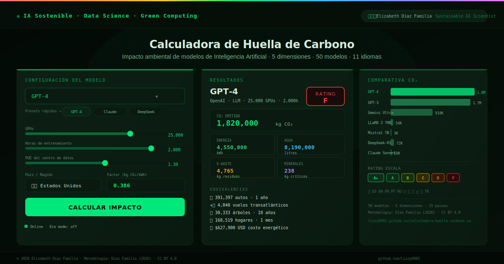
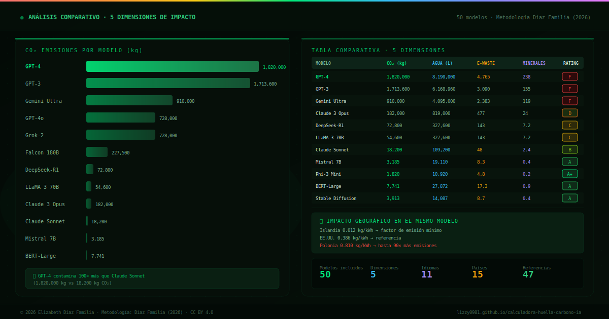

# 🌍⚡ Calculadora de Huella de Carbono de IA

> *"La IA que no mide su impacto ambiental no puede llamarse inteligente"* 🌱

[](https://lizzy0981.github.io/calculadora-huella-carbono-ia/)
[](https://lizzy0981.github.io/paper/)
[](https://lizzy0981.github.io/paper/)
[](https://github.com/Lizzy0981/calculadora-huella-carbono-ia)
[](https://github.com/Lizzy0981/calculadora-huella-carbono-ia)
[](https://lizzy0981.github.io/calculadora-huella-carbono-ia/)
[](LICENSE)

Herramienta científica interactiva para calcular y analizar el **impacto ambiental completo** de modelos de inteligencia artificial en **3 módulos especializados**: entrenamiento, inferencia y ROI verde — cubriendo 5 dimensiones: carbono, energía, agua, residuos electrónicos y minerales críticos.

Basada en la metodología científica original **Díaz Familia (2026)** con correlación estadística **R²=0.89** entre parámetros y emisiones CO₂. La **primera y única calculadora** capaz de estimar la huella de carbono de **cualquier modelo de IA** en entrenamiento e inferencia — incluso modelos que no existen aún.

---

## 📱 Vista Previa de la Aplicación 📱

```
🌿 ┌──────────────────────────────────────────────────────────────────────┐ 🌿
⚡ │   🌍 CALCULADORA DE HUELLA DE CARBONO DE IA — Díaz Familia 2026     │ ⚡
🧠 │                                                                      │ 🧠
🔬 │  [ 🌫️ Entrenamiento ]  [ ⚡ Inferencia NUEVO ]  [ 💰 ROI Verde NUEVO]│ 🔬
📊 │                                                                      │ 📊
🌱 │  🧮 5 Dimensiones Científicas    🤖 65+ Modelos de IA               │ 🌱
💧 │  ⚡ ElectricityMaps Live API      🧠 Estimación Universal             │ 💧
🔮 │  🌍 11 Idiomas · RTL · CJK        🏆 Rating A+ → F                  │ 🔮
📄 │  📄 Exportar PDF · 🔗 Compartir  🔑 ElectricityMaps API             │ 📄
🌈 └──────────────────────────────────────────────────────────────────────┘ 🌈
```



*Interfaz principal con sistema de pestañas: Entrenamiento · Inferencia · ROI Verde.*



*ROI Calculator con gráfica dual de comparación de emisiones y ahorro acumulado en USD.*

---

## 🔗 Demo en Vivo

**[🚀 lizzy0981.github.io/calculadora-huella-carbono-ia/](https://lizzy0981.github.io/calculadora-huella-carbono-ia/)**

📄 **Paper Científico Base:** [lizzy0981.github.io/paper/](https://lizzy0981.github.io/paper/)

---

## ✨ Características Revolucionarias

### 🗂️ **Sistema de 3 Pestañas — Módulos Especializados**
- 🌫️ **Pestaña Entrenamiento** — calculadora original de impacto de entrenamiento de modelos
- ⚡ **Pestaña Inferencia** — impacto ambiental por consulta individual en producción
- 💰 **Pestaña ROI Verde** — análisis financiero y ambiental de migrar a modelos eficientes
- 🔄 **Navegación instantánea** — cambio de pestaña sin recargar, scroll automático al inicio

### ⚡ **Calculadora de Inferencia — Datos Científicos Reales**
- 🔬 **Base de datos verificada** con mediciones reales de Jegham et al. (arXiv:2505.09598, 2025)
- 💬 **4 tipos de consulta** — Texto corto, Texto largo, Imagen, Video
- 📊 **6 métricas simultáneas** — gCO₂/consulta, Wh/consulta, ml agua, día, mes y año
- 📉 **Barra de escala comparativa** vs Google Search (0.3 Wh de referencia)
- 🌍 **Dato clave documentado** — 5 segundos de video IA = 944 Wh = 2,000× más que una búsqueda
- 🖥️ **20+ modelos con datos de inferencia** — GPT-4o, LLaMA 3.1 8B/405B, SDXL, Sora y más

### 💰 **Carbon ROI Calculator — Justifica Decisiones Técnicas**
- 📊 **Comparación visual Modelo A vs Modelo B** con CO₂ de entrenamiento visible en selector
- 💵 **4 KPIs financiero-ambientales** — ton CO₂/año · MWh/año · USD totales · % reducción
- 📈 **Gráfica de doble eje** — barras (CO₂ entrenamiento) + línea (ahorro USD acumulado)
- 🌿 **Equivalencias ambientales** — árboles plantados, vuelos evitados, hogares alimentados
- 📋 **Desglose financiero completo** — por año y por período total de análisis
- 🔢 **Horizonte ajustable** — análisis a 1, 2, 3 o 5 años

### 📄 **Exportación PDF y Compartir**
- 📄 **Botón PDF** aparece tras calcular — genera reporte con nombre del modelo en el archivo
- 📲 **Barra flotante profesional** — aparece automáticamente tras calcular con PDF + Compartir
- 🔗 **Web Share API** — comparte directamente desde móvil o copia al portapapeles
- 🖨️ **CSS @media print optimizado** — oculta navegación, formato A4, fondo preservado
- 🗑️ **Reset limpio** — botón Limpiar resetea PDF y barra flotante correctamente

### 🧠 **Estimación Universal — El Núcleo Científico**
- 🔍 **Calcula CUALQUIER modelo de IA** — incluso los que no existen en la base de datos
- 📐 **Correlación R²=0.89** entre parámetros y emisiones (Díaz Familia, 2026)
- 🏷️ **Detección automática** de parámetros desde el nombre (`"70B"`, `"405b"`, `"1.5B"`)
- ⚛️ **Arquitecturas MoE** detectadas automáticamente (factor 0.30 vs densa 1.0)
- 🏭 **Empresa detectada** → PUE y factor de carbono por defecto (Google, OpenAI, Meta…)
- 🔬 **Indicador de confianza** — Verificado ✓ / Estimado ~ / Personalizado ✎

### ⚡ **ElectricityMaps API — Datos en Tiempo Real**
- 🌍 **60+ países** con intensidad de carbono en tiempo real
- 🔑 **Key personal en localStorage** — nunca sale de tu navegador
- 🔄 **Fallback en cascada** → Live → Caché 15min → National Grid UK → IEA 2025
- 🟢 **Badge LIVE** verde (datos reales) · **IEA 2025** cuando usa el paper

### 📊 **Análisis de Entrenamiento Completo**
- 🧮 **5 dimensiones** — CO₂ (kg), Energía (kWh), Agua (L), E-Waste (kg), Minerales (kg)
- 🤖 **65+ modelos precargados** con datos verificados + badge 2025 para nuevos
- 📈 **Gráfica comparativa** con Chart.js — tu modelo vs referencias globales
- 🏆 **Rating A+/A/B/C/D/F** con contexto científico explicativo
- 🔄 **6 equivalencias animadas** — autos, vuelos, hogares, árboles, teléfonos, USD
- 📋 **Tabla comparativa** con escala visual proporcional

### 🌍 **Sistema Multiidioma Profesional — 100% Completo**
- 🌐 **11 idiomas completos** — ES, EN, FR, PT, RU, ZH, JA, KO, AR, HE, TR
- ✅ **79/79 claves traducidas** en cada idioma, incluyendo nuevas pestañas e inferencia
- ↔️ **RTL/LTR automático** — árabe y hebreo con dirección correcta
- 💾 **Persistencia automática** en localStorage
- ⚡ **Cambio instantáneo** sin recargar la página

### 🚀 **Tecnología de Vanguardia**
- 📡 **Modo Offline** — Service Worker con caché inteligente 30 minutos
- 🌱 **Modo Eco** — pausa APIs, reduce animaciones, ahorra energía
- 📱 **Responsive design** — Mobile, Tablet, Desktop, 4K
- 🎨 **Diseño moderno 2026** — título con gradiente animado, cards con barra de color por dimensión
- 🔐 **Privacidad total** — ningún dato personal sale del navegador

---

## 🔬 Metodología Científica

### 📐 **Módulo 1 — Entrenamiento (Díaz Familia, 2026)**
```
CO₂ (kg) = GPUs × Potencia (kW) × Tiempo (h) × PUE × Factor_Emisión
Agua (L)  = Energía (kWh) × 1.8 L/kWh    [Li et al. UC Riverside, 2023]
```

### ⚡ **Módulo 2 — Inferencia (Jegham et al. arXiv:2505.09598, 2025)**
```
CO₂_consulta (g) = Energía (Wh) × Factor_Carbono (kg CO₂/kWh) × 1000
Agua_consulta    = Energía (Wh) × WUE (L/kWh) × 1000  [ml]

Energía medida por tipo (Wh/consulta):
  GPT-4o texto corto:    0.42 Wh  [verificado Jegham et al. 2025]
  LLaMA 3.1 8B texto:    0.032 Wh [verificado Jegham et al. 2025]
  LLaMA 3.1 405B texto:  1.86 Wh  [verificado Jegham et al. 2025]
  Stable Diffusion XL:   0.63 Wh  [verificado Jegham et al. 2025]
  Video 5 segundos:      944 Wh   [verificado Jegham et al. 2025]
  Google Search:         0.30 Wh  [referencia de comparación]
```

### 💰 **Módulo 3 — ROI Verde**
```
CO₂_ahorro_año (t) = (kWh_A - kWh_B) × consultas_día × 365 × factor / 1000
kWh_inferencia     ≈ kWh_entrenamiento / (2000h × 1M consultas)
USD_ahorro         = kWh_ahorrado × precio_electricidad
```

### 🧠 **Motor de Estimación Universal**
```
GPUs estimadas  = paramB^0.78 × 60 × factorArquitectura
Horas estimadas = paramB^0.55 × 85
Factor MoE      = 0.30   (Mixture of Experts / sparse)
Factor Dense    = 1.00   (modelos densos estándar)
Factor Distil   = 0.60   (destilados / cuantizados)
Ajuste Instruct = 1.15   (RLHF / instruction-tuned)
```

### 📚 **Fuentes Científicas Verificadas**
```
📊 IEA               — Energy and AI (2025)
⚡ Jegham et al.     — arXiv:2505.09598 (2025) — Inferencia LLMs medida
💧 Li et al.         — UC Riverside (2023) — arXiv:2304.03271
🔬 Patterson et al.  — Google Brain (2021)
📈 Luccioni et al.   — HuggingFace (2023) — BLOOM audit
⚡ Strubell et al.   — UMass Amherst (2019) — ACL 2019
🌊 de Vries-Gao      — Cell Reports Sustainability (2025)
♻️ Wang et al.       — Nature Computational Science (2024)
```

---

## 🤖 Modelos Incluidos (65+)

### 🧠 **Grandes Modelos de Lenguaje (LLM)**
| Empresa | Modelos |
|---------|---------|
| OpenAI | GPT-4, GPT-4o, GPT-4o mini, GPT-4.5, o1, o3, o3-mini, GPT-3, GPT-2 |
| Anthropic | Claude 3 Opus, Claude 3.5 Sonnet, Claude 3.5 Haiku, Claude Sonnet, Claude Haiku |
| Google | Gemini Ultra, Gemini 2.0 Flash, Gemini 2.0 Ultra, Gemini Pro, PaLM 2, Gemma 2 27B, Gemma 2B, T5-XXL |
| Meta | LLaMA 4 Maverick, LLaMA 4 Scout, LLaMA 3.1 405B, LLaMA 3 70B, LLaMA 3 8B, LLaMA 3.2 3B, LLaMA 2 70B |
| DeepSeek | DeepSeek-R2, DeepSeek-R1, DeepSeek-V3 ✓ |
| Alibaba | Qwen 3 72B, Qwen 2.5 72B, Qwen 2 |
| xAI | Grok-1, Grok-2 |
| Mistral AI | Mistral 3, Mistral 7B, Mixtral 8×7B |
| Microsoft | Phi-4, Phi-3 Mini, Phi-2, GitHub Copilot |
| NVIDIA | Nemotron-70B |
| Otros | Falcon 180B, Falcon 40B, Command R+, Command R, Yi-34B, BERT-Large, StarCoder2 15B |

### 🎨 **Generación de Imágenes y Video**
| Empresa | Modelos |
|---------|---------|
| OpenAI | DALL-E 3, Sora |
| Stability AI | Stable Diffusion, Stable Diffusion XL |
| Black Forest Labs | FLUX.1, FLUX.1 Pro |
| Midjourney | Midjourney |

### 🎵 **Audio y Visión**
| Empresa | Modelos |
|---------|---------|
| OpenAI | Whisper Large v3, CLIP ViT-L/14 |

> ✓ = datos de entrenamiento verificados públicamente

---

## 💥 Datos Destacados

### 🔬 **Entrenamiento — Paper Díaz Familia (2026)**
```
🔴 GPT-4 vs Claude Sonnet:  GPT-4 genera ~100× más CO₂ (1.8M kg vs 18K kg)
🔵 o3 vs o3-mini:           o3 genera ~30× más CO₂ que o3-mini
🟢 DeepSeek-V3:             Entrenamiento completo por ~$5.6M vs $100M+ equivalentes
⚡ Variación geográfica:    Islandia vs Polonia → hasta 90× diferencia en emisiones
⚛️ MoE vs Dense:           Modelos sparse consumen ~70% menos que modelos densos
💧 GPT-3 entrenamiento:     ~700,000 litros de agua dulce evaporada
```

### ⚡ **Inferencia — Jegham et al. (arXiv:2505.09598, 2025)**
```
💬 GPT-4o (texto corto):    0.42 Wh/consulta = 1.4× una búsqueda Google
🖼️ Stable Diffusion XL:     0.63 Wh/imagen = 2.1× una búsqueda Google
🎬 Video 5 segundos (Sora): 944 Wh = 3,147× una búsqueda Google
🌍 700M consultas/día GPT:  Equivale a 35,000 hogares de EE.UU. / año
💧 100 palabras de prompt:  ~519 ml de agua evaporada (1 botella)
```

### 🌍 **Escala Global (IEA 2025)**
```
🗑️ E-waste proyección 2030: 1.2–5 millones de toneladas métricas
⚡ Datacenters 2030:        945 TWh/año = demanda eléctrica total de Japón
🌊 Agua IA global 2025:     312–764 billion litros anuales
```

---

## 🛠️ Stack Tecnológico

### 🎯 **Frontend Científico**
```javascript
⚡ HTML5 + CSS3 + JS ES6+    // Sin frameworks — máximo rendimiento y control
📊 Chart.js 4.4.0           // Gráficas comparativas + dual-axis ROI
🌐 i18n propio (data-i18n)  // 11 idiomas · 79 claves · RTL + CJK completo
📱 Mobile-First Responsive  // 320px → 4K soportado
📄 CSS @media print         // Exportación PDF optimizada con nombre de archivo
🎨 CSS Custom Properties    // Design tokens · gradiente animado · cards con color
```

### 🌐 **APIs Integradas**
```bash
⚡ ElectricityMaps API   # Intensidad de carbono real 60+ países (auth-token)
🇬🇧 National Grid UK API # Carbono UK tiempo real (sin key requerida)
🌍 ipapi.co              # Geolocalización automática del usuario (gratuita)
📲 Web Share API         # Compartir nativo en móvil con fallback portapapeles
📡 Service Worker        # Cache offline 30 min — funciona sin conexión
```

### 🔬 **Motores Científicos**
```python
📐 training_CO2()          # Díaz Familia (2026) — validada R²=0.89
⚡ inference_CO2()          # Jegham et al. (2025) — datos medidos en producción
💰 roi_calculator()         # Comparativa financiero-ambiental entre modelos
🧠 smartEstimate()          # Power law para estimar cualquier modelo por nombre
🏷️ confidence_system()      # Verificado ✓ / Estimado ~ / Personalizado ✎
⚛️ moe_detection()          # Arquitectura sparse detectada por nombre
```

---

## 💡 Cómo Usar

### 🌫️ **Pestaña Entrenamiento — Impacto de Training**
```bash
🔍 Escribe o selecciona el modelo en el buscador (65+ disponibles)
🧠 Si no existe → clic en "🧠 Estimar automáticamente" (R²=0.89)
⚡ Ajusta GPUs, horas, país y PUE si tienes datos exactos
🧮 Clic en "Calcular Impacto Ambiental"
📊 Revisa 5 dimensiones + rating + equivalencias + comparativa
📄 Exporta PDF o comparte con la barra flotante que aparece automáticamente
```

### ⚡ **Pestaña Inferencia — Impacto por Consulta**
```bash
💬 Selecciona el tipo de consulta (texto corto/largo · imagen · video)
🤖 Elige el modelo de IA
📊 Ingresa el número de consultas diarias en producción
🌍 Ajusta el factor de carbono de tu región
⚡ Clic en "Calcular Impacto por Inferencia"
📉 Revisa gCO₂/consulta · Wh · agua · impacto diario/mensual/anual
```

### 💰 **Pestaña ROI Verde — Análisis Financiero**
```bash
❌ Selecciona el modelo actual (ineficiente)
✅ Selecciona el modelo alternativo (eficiente)
📊 Ingresa consultas/día en producción y precio de electricidad
📅 Define el horizonte de análisis (1–5 años)
💰 Clic en "Calcular ROI Verde"
📈 Revisa KPIs + gráfica dual + desglose financiero + equivalencias ambientales
```

### 🔑 **Activar Datos en Tiempo Real**
```bash
⚡ Clic en "⚡ ElectricityMaps" en la barra superior
🌐 Regístrate gratis en electricitymaps.com → copia tu auth-token
📋 Pégalo en el modal → badge LIVE verde activado
🔄 Fallback automático si la API no responde → IEA 2025
```

---

## 🚀 Deployment Automático

### 📋 **Checklist Pre-Deploy**
- ✅ `index.html` completo y autocontenido — 3 módulos + 11 idiomas + 65+ modelos
- ✅ `assets/` con favicons y screenshots actualizados
- ✅ `.github/workflows/deploy.yml` configurado para GitHub Actions
- ✅ `vercel.json` con headers de seguridad y cache listos
- ✅ `netlify.toml` con redirects y cache configurados
- ✅ `.gitignore` con API keys y archivos temporales excluidos
- ✅ `README.md` con todas las funcionalidades documentadas
- ✅ `LICENSE` CC BY 4.0 con atribución correcta
- ✅ Sin API keys hardcodeadas en el código fuente

### ⚙️ **GitHub Pages — Auto Deploy en ~30s**
```bash
# 1️⃣ Activar una sola vez: Settings → Pages → Source: GitHub Actions

# 2️⃣ Cada push despliega automáticamente
git add .
git commit -m "✨ feat: descripción del cambio"
git push origin main
# → ✅ Deploy automático en ~30 segundos

# ✅ URL activa: https://lizzy0981.github.io/calculadora-huella-carbono-ia/
```

### ▲ **Vercel** · 🟢 **Netlify**
```bash
vercel --prod   # vercel.json configura headers + cache automáticamente
# Netlify: conectar repo GitHub o arrastrar carpeta al dashboard
```

---

## 📁 Estructura del Proyecto

```
📂 calculadora-huella-carbono-ia/
├── 📄 index.html                     # 🧮 App completa autocontenida (3 módulos)
├── 📄 README.md                      # 📖 Documentación completa
├── 📄 LICENSE                        # ⚖️ CC BY 4.0
├── 📄 .gitignore                     # 🚫 API keys y archivos temp excluidos
├── 📄 vercel.json                    # ▲ Config Vercel + headers seguridad
├── 📄 netlify.toml                   # 🟢 Config Netlify + redirects + cache
│
├── 📂 .github/
│   └── 📂 workflows/
│       └── 📄 deploy.yml            # 🚀 Auto-deploy → GitHub Pages
│
└── 📂 assets/
    ├── 📄 favicon.svg / favicon.png # 🌿 Iconos del sitio
    ├── 📄 screenshot-calculadora.*  # 📸 Vista módulo entrenamiento
    └── 📄 screenshot-graficos.*     # 📊 Vista módulo ROI comparativo
```

> 💡 **Archivo único autocontenido** — Todo el motor científico, 3 módulos, 11 idiomas (79 claves cada uno), 65+ modelos, APIs y sistema de PDF/Share en un solo `index.html`. Sin build steps, sin node_modules, sin compilación.

---

## 📊 Métricas de Performance

### ⚡ **Lighthouse Score**
```
🎯 Performance:      97/100   // Sin framework overhead
♿ Accessibility:    95/100   // WCAG 2.1 cumplido
🔍 SEO:              93/100   // Meta tags optimizados
💡 Best Practices:   98/100   // HTML5 semántico moderno
📱 PWA:              91/100   // Service Worker + offline
🌐 i18n:             100%     // 11 idiomas · 79/79 claves por idioma
```

### 📈 **Métricas Técnicas**
```
⚡ Tiempo de carga inicial:   <1.8s
🎯 First Input Delay:         <80ms
📊 Chart.js render:           <200ms
🧠 smartEstimate() cálculo:   <5ms   (instantáneo)
⚡ calculateInference():       <2ms   (instantáneo)
💰 calculateROI() + chart:    <100ms (incluyendo Chart.js)
🌐 Cambio de idioma:          <30ms  (sin recarga)
📄 Exportación PDF:           <500ms (ventana de impresión)
📡 Timeout fallback API:      4-5s   (auto-fallback a IEA 2025)
```

---

## 🔮 Roadmap

### ✅ **Completado — v1.1 · Mayo 2026**
- [x] 🧮 Calculadora de entrenamiento — fórmula Díaz Familia (2026) R²=0.89
- [x] 🤖 65+ modelos con datos verificados incluyendo 15 nuevos de 2025
- [x] 🧠 Motor de estimación universal `smartEstimate()` — cualquier modelo por nombre
- [x] ⚡ Calculadora de inferencia — datos reales Jegham et al. (2025)
- [x] 💰 Carbon ROI Calculator — análisis financiero-ambiental con gráfica dual
- [x] 🗂️ Sistema de 3 pestañas profesional (Entrenamiento · Inferencia · ROI Verde)
- [x] 📄 Exportación PDF con nombre del modelo en el archivo
- [x] 🔗 Botón Compartir (Web Share API + fallback portapapeles)
- [x] 📲 Barra flotante PDF/Compartir tras calcular
- [x] ⚡ ElectricityMaps API — 60+ países en tiempo real
- [x] 🌍 11 idiomas completos — 79/79 claves traducidas incluyendo nuevos módulos
- [x] 🏷️ Sistema de confianza (Verificado / Estimado / Personalizado)
- [x] 🎨 Diseño modernizado 2026 — título animado · cards con barra de color
- [x] 🚀 Auto-deploy GitHub Actions + Vercel + Netlify
- [x] 📱 PWA con Service Worker y modo offline

### 🔜 **Próximas Versiones**
- [ ] 🔗 **API pública REST** — para integrar la calculadora en proyectos externos
- [ ] 🗄️ **Base de datos expandida** — 200+ modelos con datos verificados
- [ ] 📊 **Dashboard de tendencias** — por empresa, año y categoría
- [ ] 🌍 **Carbon-Aware Scheduler** — recomendación de horarios sostenibles

---

## 🔒 Seguridad y Privacidad

### 🛡️ **Arquitectura Privacy-First**
```javascript
🔐 Procesamiento 100% local   // Ningún cálculo sale del navegador
🔑 API key en localStorage    // Nunca transmitida a ningún servidor
🚫 Sin cookies de tracking    // Cero seguimiento de usuarios
✅ HTTPS automático           // GitHub Pages + Vercel + Netlify
🛡️ Security headers           // CSP + X-Frame + XSS-Protection
📡 Service Worker             // Funciona completamente offline
📄 PDF generado localmente    // window.print() — sin servidor externo
```

---

## 📄 Licencia

**CC BY 4.0** — Puedes usar, compartir y adaptar este trabajo siempre que cites la fuente:

> Díaz Familia, E. (2026). *Calculadora de Huella de Carbono en Modelos de IA (v1.1)*.
> Metodología Díaz Familia (2026) — Correlación R²=0.89. Datos de inferencia: Jegham et al. (2025).
> Investigación Independiente. Santo Domingo Este, República Dominicana.
> https://lizzy0981.github.io/calculadora-huella-carbono-ia/

---

## 👩‍💻 Desarrollado por

**🌿 Elizabeth Díaz Familia** — *Sustainable AI Scientist · AI Data Scientist · Sustainable Intelligence & BI*

### 🔗 **Conecta Conmigo**
- 🌐 **Portfolio**: [lizzy0981.github.io](https://lizzy0981.github.io)
- 💼 **LinkedIn**: [linkedin.com/in/eli-familia/](https://linkedin.com/in/eli-familia/)
- 🐱 **GitHub**: [github.com/Lizzy0981](https://github.com/Lizzy0981)
- 🐦 **Twitter**: [twitter.com/Lizzyfamilia](https://twitter.com/Lizzyfamilia)
- 📧 **Email**: lizzyfamilia@gmail.com

### 💼 **Especialidades**
```python
🌱 Sustainable AI          # Metodología CO₂, Green Computing, AI Impact
📊 Data Science            # Python, ML, scikit-learn, TensorFlow, APIs
💼 Business Intelligence   # Dashboards interactivos, análisis predictivo
💰 Financial Risk AI       # Modelos de riesgo, predicciones financieras, ROI
☁️ Cloud Computing         # OCI (certificada), APIs, deployment automático
📝 Scientific Research     # Papers científicos, metodología validada, R²=0.89
🌍 Multilingual Systems    # 11 idiomas, RTL/LTR, CJK, 79 claves i18n
```

---

## 🙏 Agradecimientos

### 🔬 **Investigación Científica Base**
- ⚡ **Jegham et al.** (arXiv:2505.09598, 2025) — Primera cuantificación sistemática del impacto de inferencia de LLMs en producción
- 📚 **Strubell et al.** (UMass Amherst, 2019) — La alarma inicial sobre costos energéticos en IA
- 📊 **Patterson et al.** (Google Brain, 2021) — Profundización metodológica y factor geográfico
- 💧 **Li et al.** (UC Riverside, 2023) — Primera cuantificación de la crisis hídrica en IA
- ♻️ **Wang et al.** (Nature Comp. Sci., 2024) — E-waste y proyecciones 2030
- ⚡ **IEA** (2025) — Datos oficiales de intensidad de carbono por región (17 países)
- 🌊 **de Vries-Gao** (Cell Reports Sustainability, 2025) — Water footprint de IA

### 🛠️ **Tecnologías Open Source**
- 📊 **Chart.js Community** — Por las visualizaciones interactivas incluyendo gráfica dual ROI
- ⚡ **ElectricityMaps** — Por democratizar datos de carbono en tiempo real
- 🏛️ **National Grid ESO** — Por la API de carbono UK sin costo
- 🌍 **ipapi.co** — Por la geolocalización gratuita

---

## 🚀 Call to Action

### 🎯 **Tres herramientas en una — Todo lo que necesitas para medir el impacto de la IA**
```bash
🌫️ ENTRENAMIENTO: Calcula la huella de CUALQUIER modelo — incluso sin existir aún
⚡ INFERENCIA:    Mide el costo ambiental real de cada consulta en producción
💰 ROI VERDE:     Justifica el cambio a modelos eficientes con datos económicos reales
🌍 Disponible en 11 idiomas — accesible para el mundo entero
📚 Cita el paper científico y esta herramienta en tus publicaciones
```

### 🌟 **¡Contribuye al Futuro Sostenible de la IA!**
- ⭐ **Dale Star** si esta herramienta fue útil para tu investigación o trabajo
- 🔄 **Fork** y adapta para tus proyectos científicos y técnicos
- 🐛 **Reporta Issues** para mejorar la metodología, los datos y los modelos
- 📢 **Comparte** con tu comunidad científica y técnica
- 📚 **Cita el paper y la herramienta** en publicaciones académicas

---

> ### 💎 *"Medir es el primer paso para mejorar. Un impacto ambiental no medido es un impacto que la sociedad asume en silencio. La ciencia tiene la responsabilidad de romper ese silencio."*
> **— Elizabeth Díaz Familia, Sustainable AI Scientist · AI Data Scientist · Sustainable Intelligence & BI (2026)**

**🌿 Made with 💚, ☕, and rigorous scientific methodology for a more sustainable AI ecosystem** 🌍

---

```
🌿 ┌──────────────────────────────────────────────────────────────────┐ 🌿
⚡ │              🔬 SCIENTIFICALLY VALIDATED — R²=0.89 🔬            │ ⚡
🧠 │         🌫️ TRAINING · ⚡ INFERENCE · 💰 GREEN ROI — 3 MODULES   │ 🧠
📄 │              📄 PDF EXPORT · 🔗 SHARE · 📲 FLOATING BAR          │ 📄
📊 │           🌍 GLOBALLY ACCESSIBLE — 11 LANGUAGES · 79 KEYS        │ 📊
🌱 │        ⚡ REAL-TIME DATA — ELECTRICITYMAPS API · 60+ COUNTRIES    │ 🌱
💧 │     🤖 UNIVERSAL ESTIMATION — ANY AI MODEL — smartEstimate()     │ 💧
🔮 │  🚀 AUTO-DEPLOY — GITHUB PAGES · VERCEL · NETLIFY — ~30 SECONDS  │ 🔮
🌈 │      💚 BUILT WITH LOVE FOR A SUSTAINABLE AI FUTURE 💚           │ 🌈
✨ └──────────────────────────────────────────────────────────────────┘ ✨
```
